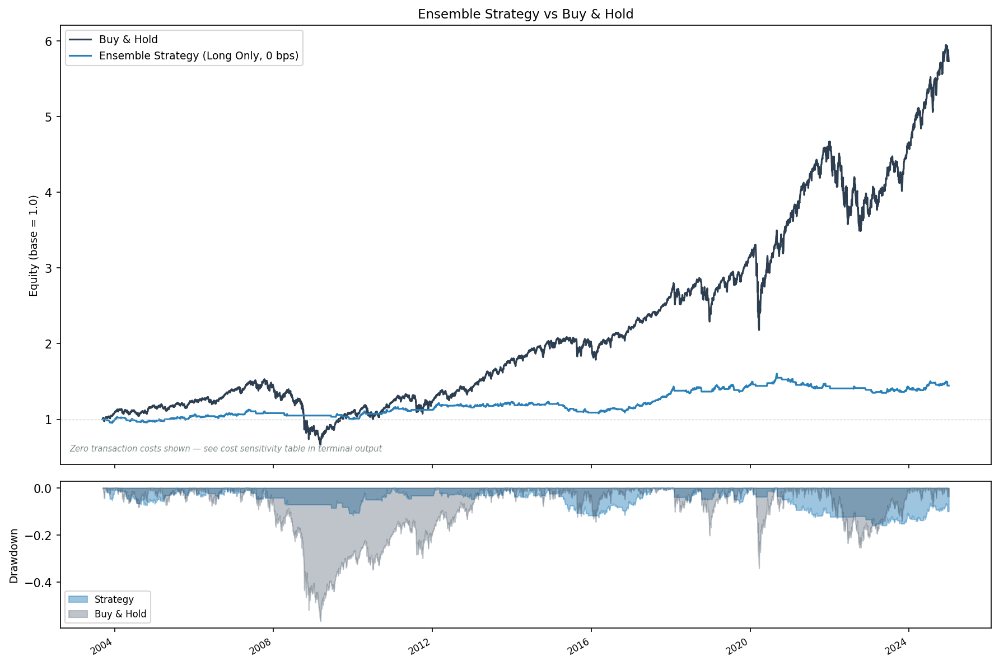
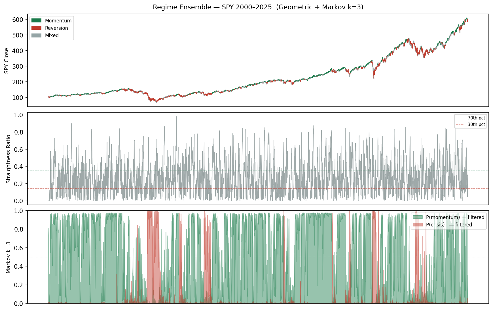

# Regime Ensemble

Detects daily equity market regimes (momentum / reversion / mixed) using a two-model ensemble, then backtests a simple long/cash strategy against buy-and-hold. The primary goal is **risk reduction**, not return maximisation.

| Strategy vs Buy & Hold | Regimes detected on SPY price |
|---|---|
|  |  |

---

## Results at a Glance

SPY · 2000–2025 · zero transaction costs · 1-day execution lag · **v5 core strategy**

| Metric | Strategy | Buy & Hold |
|---|---|---|
| CAGR | +5.7% | **+8.6%** |
| Sharpe Ratio | **0.68** | 0.44 |
| Max Drawdown | **-16.7%** | -56.5% |
| T-stat (p-value) | 3.13 (p=0.002) | 2.02 (p=0.043) |

> **Strategy = full long on momentum, half-long on mixed, cash on reversion.** Sharpe beats buy-and-hold (0.68 vs 0.44) with dramatically lower drawdown (-16.7% vs -56.5%). Sharpe exceeds B&H to ~12 bps round-trip; strategy break-even is ~17 bps.

v6.0 adds vol-ratio dampening, multi-scale geometric, and expanding-window OOS validation — see the [v6 technical report](docs/SPY_v6_report.pdf) for those results.

---

## Reports & Documents

| Document | Version | Audience | Description |
|---|---|---|---|
| [3-Page Overview (PDF)](docs/SPY_3page_report.pdf) | v5 | General | Plain-English walkthrough: price, signals, equity curves, limitations |
| [Technical Quant Report (PDF)](docs/SPY_quant_report.pdf) | v5 | Quantitative | KDE distributions, K-S tests, transition matrix, rolling IC, full attribution |
| [v6 Technical Report (PDF)](docs/SPY_v6_report.pdf) | **v6** | Quantitative | Vol ratio dampening, multi-scale geometric, expanding-window OOS validation |
| [v4/v5 Changes (PDF)](docs/v4v5_changes_report.pdf) | v4/v5 | Developer | What changed: half-position mixed regime, persistence filter, walk-forward OOS |

---

## How It Works

### 1 · Geometric Detector — Path Shape

Measures how straight the last 15 days of price movement was:

```
ratio(t) = |cumulative return over window| / sum of |daily returns|
```

- **Near 1.0** → price moved in a straight line → momentum
- **Near 0.0** → price zigzagged back to start → mean-reversion

Thresholds are adaptive percentiles (top/bottom 30% of the distribution), not fixed values. No parameters to estimate — zero fitting cost, fast.

### 2 · Markov Switching AR(1) — Hidden State

A statistical model that learns three hidden market states from daily return patterns. k=3 is selected by BIC (ΔBIC = 82 over k=2):

| Regime | Mean return | Vol (ann.) |
|---|---|---|
| Momentum | +0.142%/day | 10% |
| Choppy | -0.029%/day | 23% |
| Crisis | -0.199%/day | 16% |

Uses **filtered probabilities only** — no look-ahead bias. When P(crisis) > 0.50, the buy signal is suppressed regardless of other indicators.

### 3 · Ensemble

```
score = mean( geometric_signal, markov_momentum_probability )
```

- Score >= 0.65 → **momentum** (hold)
- Score <= 0.35 → **reversion** (cash)
- 0.35 – 0.65  → **mixed** (half-long)

Equal weighting is deliberate — fitting weights to historical returns would be in-sample optimisation. The value comes from combining two orthogonal signals: short-term path shape vs long-term statistical state.

---

## Setup

```bash
git clone https://github.com/benedictprimmer-web/regime_ensemble.git
cd regime_ensemble
pip install -r requirements.txt
cp .env.example .env
# Add your Polygon.io API key to .env
```

---

## Usage

```bash
# Standard backtest (SPY 2000-2025)
python3 run.py --skip-bic

# Custom ticker and date range
python3 run.py --ticker QQQ --from 2010-01-01 --to 2025-01-01 --skip-bic
```

```bash
# v6 features
python3 run.py --vol-signal --multi-scale --skip-bic        # vol dampening + multi-scale geo
python3 run.py --expanding --skip-bic                       # expanding-window honest backtest (~5-10 mins)
```

```bash
# Validation
python3 run.py --walkforward --skip-bic                     # walk-forward OOS (10 folds x 63 days)
python3 run.py --multi-asset --skip-bic                     # SPY, QQQ, IWM, TLT, GLD comparison
```

```bash
# Generate reports (uses cached data, no API key needed once cached)
python3 generate_report_v6.py       # v6 technical report (3 pages)
python3 generate_report_3page.py    # plain-English overview (3 pages)
python3 generate_report_quant.py    # full quant report (3 pages)
```

```bash
# Research / experimental
python3 run.py --fetch-vix --vix-signal --skip-bic          # VIX dampening (paid Polygon plan)
python3 run.py --short --skip-bic                           # allow short on reversion (signal weak)
python3 run.py --min-hold 3 --skip-bic                      # persistence filter: 3-day minimum hold
python3 run.py --vol-signal --multi-scale --min-hold 3 --skip-bic  # combined v6 + persistence
```

Outputs are saved to `outputs/` and prefixed with `{ticker}_{from}_{to}_`.

---

## Limitations

These are not afterthoughts — they are the primary reasons results should not be extrapolated.

1. **Strategy underperforms B&H on raw CAGR** — +5.7% vs +8.6% over 25 years. The edge is a better Sharpe (0.68 vs 0.44) and dramatically lower drawdown. The signal is statistically significant (T=3.13, p=0.002).
2. **Transaction costs are material** — ~61 ensemble label switches/year means costs compound. Sharpe exceeds B&H to ~12 bps round-trip; strategy breaks even at ~17 bps. The earlier figure of ~20 switches/year referred to Markov internal state transitions, not the trading signal changes that actually drive costs.
3. **In-sample threshold calibration** — percentile thresholds and ensemble cutoffs were tuned on the full dataset. Real-time use requires expanding-window recalibration (see `--expanding`).
4. **Reversion signal is not significant** — reversion p=0.73 over 25 years. The `--short` flag exists for research only.
5. **Calibrated on SPY** — thresholds and Markov parameters are fitted on SPY. The `--multi-asset` flag applies the same model to QQQ, IWM, TLT, and GLD as a validation check, but each asset's regime structure differs and results vary. A proper multi-asset deployment would require per-asset calibration.

---

## Project Structure

```
regime_ensemble/
├── run.py                      -- main entry point (backtest + charts)
├── generate_report_3page.py    -- 3-page plain-English PDF report
├── generate_report_quant.py    -- 3-page technical quant PDF report
├── generate_report_v6.py       -- 3-page v6 technical PDF report
├── generate_report_v4v5.py     -- 2-page v4/v5 changes PDF report
├── generate_report.py          -- v2 methodology one-pager (historical)
├── requirements.txt
├── .env.example                -- copy to .env, add POLYGON_API_KEY
├── src/
│   ├── data.py                 -- Polygon.io fetcher, CSV cache, multi-ticker support
│   ├── geometric.py            -- straightness ratio, adaptive thresholds, multi-scale
│   ├── markov.py               -- Markov k=3, BIC selection, filtered probabilities
│   ├── ensemble.py             -- combine signals, vol dampening, crisis override
│   ├── backtest.py             -- backtest engine, cost sensitivity, performance stats
│   ├── walkforward.py          -- walk-forward OOS validation (10 x 63-day folds)
│   └── expanding.py            -- expanding-window honest backtest (annual refit)
├── docs/
│   ├── SPY_3page_report.pdf    -- plain-English overview (v5)
│   ├── SPY_quant_report.pdf    -- full technical quant report (v5)
│   ├── SPY_v6_report.pdf       -- v6 features technical report
│   ├── v4v5_changes_report.pdf -- v4/v5 methodology changes
│   ├── equity_curves.png       -- strategy vs buy-and-hold
│   └── regime_overview.png     -- SPY price coloured by regime
└── data/cache/                 -- cached CSV files (gitignored)
```

---

## Changelog

### v6.0 (latest)
- **Vol ratio dampening** (`--vol-signal`) — 5-day / 63-day realised vol ratio suppresses the Markov momentum signal when short-term vol exceeds 2x the baseline. Active on ~11% of trading days. Endogenous (no API required), orthogonal to existing signals.
- **Multi-scale geometric** (`--multi-scale`) — averages the straightness ratio across 5, 15, and 30-day windows before thresholding. More robust across volatility regimes; reduces single-window noise.
- **Expanding-window honest backtest** (`--expanding`) — refits geometric thresholds and Markov model annually on all data up to that date. Optimism bias vs in-sample = 0.03 Sharpe points (small gap).

### v5.0
- **Walk-forward OOS equity curve** (`--walkforward`) — all 10 fold returns stitched into a continuous out-of-sample equity curve.
- **Multi-asset validation** (`--multi-asset`) — runs on SPY, QQQ, IWM, TLT, GLD; prints comparison table and saves grouped bar chart.

### v4.0
- **Half-position on mixed days** — mixed regime has T=3.21, p=0.001. Changed from cash to +0.5 long. Sharpe improves 0.29 → 0.68; strategy T-stat 1.32 (p=0.19) → 3.13 (p=0.002).
- **Regime persistence filter** (`--min-hold N`) — requires N consecutive days before position switches. At `--min-hold 3`: profitable to ~20 bps vs ~15 bps unfiltered.
- **Markov convergence fix** — `em_iter=200` with `search_reps=5` random starts eliminates ConvergenceWarning on 25-year data.

### v3.0
- Extended data to 2000-2025 — covers dot-com crash, GFC 2008, COVID 2020, and 2022 bear market.
- VIX signal integration (`--vix-signal`) — VIX as continuous dampening factor on momentum signal.
- Walk-forward extended to 10 folds.

### v2.0
- Fixed walk-forward leakage — Markov EM now fitted on train-only data; test slice forward-filtered with frozen parameters.
- Extended data pipeline — default range 2000-2025, `--ticker` flag for any Polygon ticker.

### v1.0
- Initial release: geometric + Markov k=3 ensemble on SPY 2022-2025, walk-forward validation, transaction cost sensitivity.
